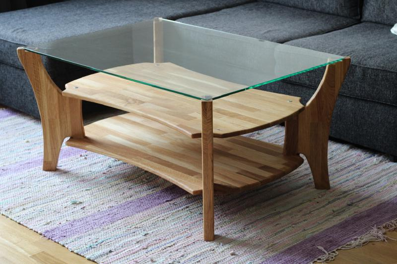

# Coffee table CT1

CT1 is a parametric cadquery model of a coffeetable.



Fullscreen [3D-model](https://blog.gntech.se/en/models/ct1/) of the coffee table

Read more about the design on my website https://blog.gntech.se/en/projects/ct1/

## How to build the model

To run the model from command line you can install cadquery using pip in an venv.

``` bash
python3 -m venv cadquery-venv
source cadquery-venv/bin/activate
pip install cadquery
python ct1.py
```

Or use the CQ-editor that has cadquery included.

See instructions here [Install cadquery](https://cadquery.readthedocs.io/en/latest/installation.html)

